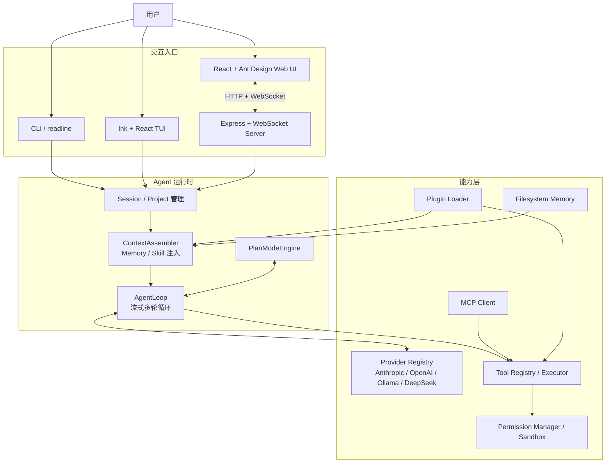

# personal-agent

> 本地优先、支持多模型供应商的 AI 编程 Agent，可通过 CLI、终端 TUI 或 Web UI 使用。

[](LICENSE)
[](https://www.typescriptlang.org/)
[](https://nodejs.org/)
[](https://pnpm.io/)

## 目录

- [项目简介](#项目简介)
- [主要能力](#主要能力)
- [技术架构](#技术架构)
- [目录结构](#目录结构)
- [快速开始](#快速开始)
- [配置说明](#配置说明)
- [使用方式](#使用方式)
- [开发指南](#开发指南)
- [构建与部署](#构建与部署)
- [运行时数据](#运行时数据)
- [安全说明](#安全说明)
- [许可证](#许可证)

## 项目简介

`personal-agent` 是一个 TypeScript 编写的 AI 编程助手。它以统一的 Agent 核心连接 Anthropic、OpenAI、Ollama 和 DeepSeek，能够在模型对话过程中读取和修改代码、执行命令、搜索项目、访问 Web，并通过权限确认和路径沙箱约束高风险操作。

项目提供三种交互入口：

- **CLI 单次模式**：执行一个 Prompt 后退出，适合脚本和自动化任务。
- **终端交互模式**：默认使用 Ink/React TUI；非 TTY 环境或指定 `--no-tui` 时使用 readline。
- **Web UI**：提供多项目、多任务、流式消息、工具审批、Plan 模式和 Provider 设置。

## 主要能力

- Anthropic、OpenAI、Ollama、DeepSeek 多 Provider 适配
- 流式文本、思考内容和工具调用
- 文件读取、写入、编辑与目录浏览
- Glob/Grep 代码搜索与 Shell 命令执行
- Web 抓取、搜索、Todo 和用户询问工具
- 工具参数校验、权限确认、路径沙箱和危险命令拦截
- 会话自动持久化与最近会话恢复
- 文件系统长期记忆及相关上下文自动注入
- 模型请求统计（SQLite）：每次模型调用的 token、状态、耗时明细，`/stats` 与 `/stats-recent` 命令
- MCP `stdio`、SSE、Streamable HTTP 工具接入
- 插件工具、Markdown Skill 和生命周期 Hook
- 只读 Plan 模式及结构化执行进度
- CLI 子 Agent，以及 Web 多项目、多任务工作区

## 技术架构

### 总体架构



### Agent 执行流程

1. CLI 或 Web Runtime 接收用户输入。
2. `ContextAssembler` 组合系统指令、对话历史、相关记忆和匹配到的 Skill。
3. `AgentLoop` 检查 Token 预算，并调用当前 `LLMProvider` 获取流式响应。
4. 如果模型发起工具调用，`ToolExecutor` 依次执行参数校验、沙箱检查和权限判断。
5. 工具结果写回上下文，Agent 继续推理，直到正常结束、达到最大轮次或被用户中断。
6. 完成的消息、用量和项目任务关系写入本地持久化目录。

### 核心包职责

| 模块                       | 职责                                                               |
| -------------------------- | ------------------------------------------------------------------ |
| `@personal-agent/shared`   | 统一消息、工具、模型和事件类型，以及日志、ID、Token 估算等公共能力 |
| `@personal-agent/config`   | Zod 配置校验、YAML 加载、环境变量和 CLI 参数合并                   |
| `@personal-agent/provider` | `LLMProvider` 抽象及 Anthropic、OpenAI、Ollama、DeepSeek 适配      |
| `@personal-agent/tool`     | 内置工具注册、参数校验、权限管理、沙箱和执行结果后处理             |
| `@personal-agent/core`     | Agent 循环、上下文、Token 预算、会话、项目、Plan 和子 Agent        |
| `@personal-agent/memory`   | 基于 JSON/Fuse.js 的文件系统长期记忆                               |
| `@personal-agent/mcp`      | MCP 客户端、传输层和远程工具注册                                   |
| `@personal-agent/plugin`   | 插件发现、工具加载、Skill 匹配和生命周期 Hook                      |
| `@personal-agent/tui`      | Ink/React 终端界面及状态管理                                       |

### 技术栈

| 类别         | 技术                                                 |
| ------------ | ---------------------------------------------------- |
| 语言与运行时 | TypeScript 5.7、Node.js 20+、ESM                     |
| Monorepo     | pnpm workspace、Turborepo                            |
| 构建         | tsup、esbuild、Vite                                  |
| CLI / TUI    | Commander、readline、Ink 5、React 18                 |
| Web          | Express 5、WebSocket、React 18、Ant Design 6、Vite 8 |
| 配置         | Zod、YAML                                            |
| LLM SDK      | `@anthropic-ai/sdk`、`openai`、Ollama HTTP API       |
| 扩展         | Model Context Protocol SDK、动态插件                 |
| 测试         | Node.js Test Runner + `tsx --test`                   |

## 目录结构

```text
personal-agent/
├─ apps/
│  ├─ cli/
│  │  └─ src/index.ts            # CLI 入口、运行时组装、Slash 命令和 TUI 启动
│  ├─ web/
│     ├─ client/
│     │  └─ src/                 # React Web UI
│     ├─ src/
│     │  ├─ server.ts            # Express、HTTP API 和 WebSocket 服务
│     │  ├─ runtime.ts           # Web Agent Runtime 与会话编排
│     │  └─ protocol.ts          # 前后端 WebSocket 协议
│     ├─ test/                   # Web 协议与服务测试
│     └─ vite.config.ts
│  └─ desktop/
│     ├─ src/main.ts             # Electron 主进程与内嵌 Web Server
│     ├─ src/preload.ts          # 受限的桌面能力桥接
│     └─ electron-builder.yml     # Windows 安装包配置（NSIS 向导 + 自动更新）
├─ packages/
│  ├─ shared/                    # 公共类型与工具函数
│  ├─ config/                    # 配置 Schema、默认值和加载器
│  ├─ provider/                  # LLM Provider 适配层
│  ├─ tool/                      # 内置工具、权限和沙箱
│  ├─ core/                      # Agent、上下文、会话、项目、Plan、子 Agent
│  ├─ tui/                       # Ink 终端界面
│  ├─ memory/                    # 长期记忆
│  ├─ mcp/                       # MCP 客户端
│  └─ plugin/                    # 插件、Skill 和 Hook
├─ docs/
│  └─ PRD_V1.md                  # 产品需求与阶段说明
├─ .changeset/                   # 包版本和发布变更记录
├─ package.json                  # 根命令与开发依赖
├─ pnpm-workspace.yaml           # Workspace 范围
├─ turbo.json                    # 构建任务依赖和缓存
└─ tsconfig.base.json            # TypeScript 公共配置
```

各包构建产物写入对应的 `dist/`，不会提交到 Git。

## 快速开始

### 前置条件

- Node.js `>= 20.0.0`
- pnpm `11.x`，仓库锁定版本为 `11.17.0`
- 至少一个可用的云端 API Key，或本机运行的 Ollama

建议通过 Corepack 使用项目指定的 pnpm：

```bash
corepack enable
corepack prepare pnpm@11.17.0 --activate
```

也可以直接使用npm安装

```bash
npm install --g pnpm
```

### 安装依赖

```bash
git clone <repository-url> personal-agent
cd personal-agent
pnpm install --frozen-lockfile
```

### 配置 Provider

最简单的方式是设置环境变量。

macOS / Linux：

```bash
export PERSONAL_AGENT_ANTHROPIC_API_KEY="sk-ant-..."
# 或
export PERSONAL_AGENT_OPENAI_API_KEY="sk-..."
# 或
export PERSONAL_AGENT_DEEPSEEK_API_KEY="sk-..."
```

PowerShell：

```powershell
$env:PERSONAL_AGENT_ANTHROPIC_API_KEY = "sk-ant-..."
# 或
$env:PERSONAL_AGENT_OPENAI_API_KEY = "sk-..."
```

使用 Ollama 时，在配置文件中启用它：

```yaml
# ~/.personal-agent/config.yaml
providers:
  active: ollama
  ollama:
    baseURL: http://localhost:11434
    defaultModel: llama3.1
```

### 启动

```bash
# 默认启动终端 TUI
pnpm cli

# 启动 Web UI（默认 http://127.0.0.1:5678）
pnpm web

# 启动 Electron 桌面版
pnpm desktop
```

## 配置说明

### 配置文件

默认支持两个 YAML 配置位置：

- 全局配置：`~/.personal-agent/config.yaml`
- 项目配置：`<workspace>/.personal-agent/config.yaml`

也可以为 CLI 传入 `--config <path>`，或为 Web 设置 `PERSONAL_AGENT_CONFIG`。

下面是一个覆盖主要配置项的示例：

```yaml
providers:
  active: openai

  anthropic:
    # 建议通过 PERSONAL_AGENT_ANTHROPIC_API_KEY 注入，不要提交密钥
    defaultModel: claude-sonnet-5-20251001
    models:
      - claude-sonnet-5-20251001

  openai:
    defaultModel: gpt-4o
    # 可用于兼容 OpenAI API 的服务
    # baseURL: https://example.com/v1
    models:
      - gpt-4o
      - gpt-4o-mini
    # models 也支持对象形式，显式指定上下文窗口与最大输出 Token：
    # models:
    #   - id: gpt-4o
    #     contextWindow: 128000
    #     maxOutputTokens: 16384

  ollama:
    baseURL: http://localhost:11434
    defaultModel: llama3.1

  deepseek:
    baseURL: https://api.deepseek.com
    defaultModel: deepseek-v4-flash
    # 思考强度：off | low | high | max（medium 不支持，按 low 处理）
    thinkingEffort: high

  volcano:
    baseURL: https://ark.cn-beijing.volces.com/api/v3
    defaultModel: doubao-seed-1-6-250615
    models:
      - doubao-seed-1-6-250615
      - doubao-seed-thinking-250615

agent:
  maxTurns: 100           # 最大循环轮数（1-500），也可在 Web UI「设置 -> 通用」中修改
  maxTokens: 16384        # 单次模型输出的最大 Token 数
  temperature: 0          # 采样温度（0-2）
  systemPromptAppend: ""  # 附加到系统提示词末尾的额外指令
  planMode:
    enabled: true         # 是否启用只读 Plan 模式
    autoApprove: false    # 计划是否自动批准

tools:
  shellTimeout: 120000    # Shell 命令超时（毫秒）
  webFetchTimeout: 30000  # Web 抓取超时（毫秒）
  sandbox:
    restrictPaths: true   # 限制文件工具只能访问工作区及 allowedPaths
    allowedPaths: []
    deniedCommands:
      - shutdown
      - reboot
  permissions:
    - tool: bash
      # pattern: "rm -rf *"   # 可选：按参数正则匹配该规则
      action: approval
      scope: project

mcp:
  servers:
    - name: local-tools
      transport: stdio
      command: node
      args:
        - /absolute/path/to/mcp-server.js
      # cwd: /absolute/path/to/server-dir   # 可选：MCP 进程工作目录
      # env:                                 # 可选：附加环境变量
      #   FOO: bar
      autoApprove:
        - safe_read_tool
    # - name: remote-tools
    #   transport: sse                # 或 streamable-http
    #   url: http://127.0.0.1:8000/sse
    #   headers:
    #     Authorization: Bearer <token>

memory:
  enabled: true
  store: filesystem        # filesystem | sqlite
  maxEntries: 1000

tui:
  theme: dark              # dark | light | system
  showTokenCounter: true
  showCostEstimates: true
  enableMouse: false

stats:
  enabled: true
  # dbPath: /custom/path/model-requests.db   # 默认 ~/.personal-agent/stats/model-requests.db
  # recordPayloads: true   # 开启后新请求才存储完整入参出参（messages/tools/options）
  retentionDays: 90        # 0 = 不自动清理

plugins:
  enabled: true
  paths:
    - /absolute/path/to/plugins
  disabled: []

skills:
  enabled: true
  # 额外的 Skill 目录（标准 SKILL.md 格式，见下文），默认仅生效：
  # ~/.personal-agent/skills（Web 端上传技能的目标目录）
  paths:
    - /absolute/path/to/skills
```

### 配置项一览

| 配置项（YAML 路径） | 类型 / 可选值 | 默认值 | 说明 |
| --- | --- | --- | --- |
| `providers.active` | `anthropic` / `openai` / `ollama` / `deepseek` / `volcano` | 无 | 当前激活的 Provider |
| `providers.<id>.apiKey` | string | 无 | Provider API Key（推荐用环境变量注入） |
| `providers.<id>.baseURL` | string | Provider 内置默认地址 | API 服务地址 |
| `providers.<id>.defaultModel` | string | Provider 内置默认模型 | 默认模型 |
| `providers.<id>.models` | `string[]` 或 `{id, contextWindow, maxOutputTokens}[]` | Provider 内置模型列表 | 可用模型列表 |
| `providers.<id>.thinkingEffort` | `off` / `low` / `medium` / `high` / `max` | 无 | 思考类模型的推理强度 |
| `agent.maxTurns` | number（1-500） | `100` | 单次任务最大循环轮数（Web 通用设置最低 50） |
| `agent.maxTokens` | number | 无 | 单次模型输出最大 Token 数 |
| `agent.temperature` | number（0-2） | `0` | 模型采样温度 |
| `agent.systemPromptAppend` | string | 无 | 附加到系统提示词末尾的额外指令 |
| `agent.planMode.enabled` | boolean | `true` | 是否启用只读 Plan 模式 |
| `agent.planMode.autoApprove` | boolean | `false` | 计划是否自动批准 |
| `tools.shellTimeout` | number（毫秒） | `120000` | Shell 命令超时 |
| `tools.webFetchTimeout` | number（毫秒） | `30000` | Web 抓取超时 |
| `tools.sandbox.restrictPaths` | boolean | `true` | 限制文件工具只能访问工作区及 allowedPaths |
| `tools.sandbox.allowedPaths` | string[] | `[]` | 额外允许访问的路径 |
| `tools.sandbox.deniedCommands` | string[] | `[]` | 额外拦截的危险命令片段 |
| `tools.permissions` | `{tool, pattern?, action, scope, target?}[]` | `[]` | 权限规则（action: allow/ask/approval；scope: session/project/global；target: all / `task:<id>` / `project:<id>`，缺省 `all` 对所有任务生效） |
| `mcp.servers` | 对象数组 | `[]` | MCP 服务器（transport: stdio/sse/streamable-http；支持 command/args/cwd/url/env/headers/autoApprove） |
| `memory.enabled` | boolean | `true` | 是否启用长期记忆 |
| `memory.store` | `filesystem` / `sqlite` | `filesystem` | 记忆存储后端 |
| `memory.maxEntries` | number | `1000` | 记忆最大条目数 |
| `tui.theme` | `dark` / `light` / `system` | `dark` | TUI 主题 |
| `tui.showTokenCounter` | boolean | `true` | TUI 是否显示 Token 计数 |
| `tui.showCostEstimates` | boolean | `true` | TUI 是否显示费用估算 |
| `tui.enableMouse` | boolean | `false` | TUI 是否启用鼠标 |
| `stats.enabled` | boolean | `true` | 是否启用模型请求统计 |
| `stats.dbPath` | string | `~/.personal-agent/stats/model-requests.db` | 统计数据库路径 |
| `stats.recordPayloads` | boolean | `false` | 是否保存完整入参/出参（仅影响新请求） |
| `stats.retentionDays` | number | `90` | 统计保留天数（0 = 不清理） |
| `plugins.enabled` | boolean | `true` | 是否加载插件 |
| `plugins.paths` | string[] | `[]` | 插件目录列表 |
| `plugins.disabled` | string[] | `[]` | 禁用的插件名列表 |
| `skills.enabled` | boolean | `true` | 是否加载标准 Skill 目录（Claude Code / Codex 格式） |
| `skills.paths` | string[] | `[]` | 额外的标准 Skill 目录列表 |

注意：

- YAML 中的数组采用整体替换，不会与上一层配置合并。
- `tools.permissions` 当前由 Web Runtime 加载；CLI 中可使用 `/allow`、`/approval` 或启动参数 `-y` 管理当前会话权限。
- `tools.permissions` 规则是全局共享的基线，对所有任务生效；设置 `target: task:<id>` 或 `target: project:<id>` 可使规则仅作用于目标任务/项目，且任务特定规则优先于全局规则（例如默认放行 `bash`，但 `target: task:task-abc` 下改为 `ask`）。
- `agent.temperature`、`agent.maxTokens` 及对应 CLI 参数当前接入 Web Runtime；CLI 已完成参数解析，但尚未传入模型流式调用。
- `agent.maxTurns` 可在 Web UI「设置 -> 通用」中修改（允许范围 50-500，低于 50 会被拒绝），保存后写入配置文件，对新建任务立即生效；CLI 与配置文件仍使用 schema 允许的 1-500 完整范围。
- 当前运行时默认使用文件系统 Memory Store（`memory.store: filesystem`），也可切换为 `sqlite`。
- `-y, --yes` 会自动批准全部工具，只应在可信工作区和受控环境中使用。

### 标准 Skill（Claude Code / Codex 兼容格式）

项目直接兼容 Claude Code 与 OpenAI Codex 的标准 Skill 目录格式，两者约定一致：

```text
<skill目录>/
└── <skill-name>/
    ├── SKILL.md          # 必需：frontmatter（name/description）+ Markdown 指令正文
    ├── agents/           # 可选
    ├── scripts/          # 可选
    ├── references/       # 可选
    └── assets/           # 可选
```

`SKILL.md` 示例：

```markdown
---
name: code-review
description: Use when reviewing code, pull requests, or merge requests
---

# Code Review

严格按照以下步骤执行代码审查：...
```

- **生效范围**：仅 `~/.personal-agent/skills` 内的技能生效（Web 端上传的目标目录）；`skills.paths` 配置的目录为可选扩展。每个目录包含 `<skill-name>/SKILL.md`，隐藏目录（如 Codex 的 `.system`）会被跳过。
- **frontmatter**：`name` 与 `description` 为标准必填字段；`triggers` 是本项目的可选扩展字段（关键词自动触发），Claude Code / Codex 会忽略它，不影响文件在其它工具中的兼容性。缺少 frontmatter 时回退使用目录名。
- **使用方式**：
  - **显式指定**（推荐）：输入 `/skill-name` 强制使用该技能（兼容 `#skill-name`），引用标记会自动从发给模型的输入中移除。例如「请用 **/code-review** 审查这段代码」。Web 输入框输入 `/` 会弹出技能选择列表，点击或输入前缀即可选择；CLI 中输入完整的 `/技能名` 也会直接触发该技能。
  - **自动匹配**：输入命中技能的 `triggers` 关键词、技能名或描述（子串匹配）时自动注入，无需显式指定。
  - 命中一个或多个技能时，其内容以 `## Skill: <name>` 注入系统提示词；与 `plugin.json` 声明的技能走同一套匹配/注入流程，可同时使用。
- **Web 上传**：Web UI「设置 -> 技能」支持上传技能 zip 压缩包（单技能根目录 + `SKILL.md`，可附带 scripts/references/assets），**技能目录名取自 zip 文件名**（去掉 `.zip` 后缀），安装到 `~/.personal-agent/skills`（与插件、配置等同一根目录）后立即生效，无需重启。上传会校验结构（单个 SKILL.md）、拒绝路径穿越（zip-slip）与超大文件。
- 插件内的技能（`plugin.json` 的 `skills` 字段）格式保持不变，仍然兼容。

### 配置优先级

正常自动发现时，后加载的配置覆盖先加载的配置：

```text
内置默认值
  < 全局配置 ~/.personal-agent/config.yaml
  < 项目配置 ./.personal-agent/config.yaml
  < PERSONAL_AGENT_* 环境变量
  < CLI 参数
```

使用 `--config` 或 Web 的 `PERSONAL_AGENT_CONFIG` 时，全局配置会被跳过，顺序变为：

```text
内置默认值 < 项目配置 < 指定配置文件 < 环境变量 < CLI 参数
```

### 支持的配置环境变量

| 环境变量                           | 用途                                   |
| ---------------------------------- | -------------------------------------- |
| `PERSONAL_AGENT_PROVIDER`          | 默认激活的 Provider（anthropic/openai/ollama/deepseek/volcano） |
| `PERSONAL_AGENT_MODEL`             | 默认模型名（作用于当前激活的 Provider） |
| `PERSONAL_AGENT_ANTHROPIC_API_KEY` | Anthropic API Key                      |
| `PERSONAL_AGENT_OPENAI_API_KEY`    | OpenAI API Key                         |
| `PERSONAL_AGENT_DEEPSEEK_API_KEY`  | DeepSeek API Key，并补充默认地址和模型 |
| `PERSONAL_AGENT_VOLCANO_API_KEY`   | 火山方舟 API Key，并补充默认地址和模型 |
| `PERSONAL_AGENT_OLLAMA_BASE_URL`   | Ollama 服务地址                        |
| `PERSONAL_AGENT_MAX_TURNS`         | 单次 Agent 运行的最大轮次              |
| `PERSONAL_AGENT_MAX_TOKENS`        | 最大输出 Token 数                      |
| `PERSONAL_AGENT_TEMPERATURE`       | 模型温度                               |

Web Server 还支持以下运行时变量：

| 环境变量                       | 默认值                            | 用途                      |
| ------------------------------ | --------------------------------- | ------------------------- |
| `PERSONAL_AGENT_WEB_HOST`      | `127.0.0.1`                       | Web 监听地址              |
| `PORT`                         | `5678`                            | Web 监听端口              |
| `PERSONAL_AGENT_WEB_TOKEN`     | 无                                | HTTP / WebSocket 访问令牌 |
| `PERSONAL_AGENT_WORKSPACE`     | 自动查找 workspace                | 默认工作区                |
| `PERSONAL_AGENT_CONFIG`        | 默认配置路径                      | Web 使用的显式配置文件    |
| `PERSONAL_AGENT_PROJECTS_PATH` | `~/.personal-agent/projects.json` | 项目与任务元数据文件      |
| `PERSONAL_AGENT_SESSIONS_PATH` | `~/.personal-agent/sessions`      | 会话存储目录              |

## 使用方式

### CLI

```bash
# 交互式 TUI
pnpm cli

# 强制使用普通 readline 界面
pnpm cli -- --no-tui

# 执行一次 Prompt 后退出
pnpm cli -- "解释 packages/core/src/agent-loop.ts 的执行流程"

# 指定 Provider 和模型
pnpm cli -- --provider openai --model gpt-4o "分析当前项目"

# 恢复最近一次会话
pnpm cli -- --resume

# 恢复指定会话
pnpm cli -- --session <session-id>

# 查看完整参数
pnpm cli -- --help
```

构建并发布 CLI 包后，也可以通过 `personal-agent` 或短命令 `pa` 使用同一组参数。

常用 Slash 命令：

| 命令               | 作用                       |
| ------------------ | -------------------------- |
| `/help`            | 显示命令帮助               |
| `/clear`           | 清空当前上下文             |
| `/plan`            | 进入只读 Plan 模式         |
| `/exit-plan`       | 批准当前计划并恢复执行工具 |
| `/plan-status`     | 查看结构化计划进度         |
| `/save`            | 保存当前会话               |
| `/load <id>`       | 加载指定会话               |
| `/sessions`        | 列出已保存会话             |
| `/permissions`     | 查看当前权限规则           |
| `/allow <tool>`    | 当前会话允许指定工具       |
| `/approval <tool>` | 指定工具每次需要审批       |
| `/exit`            | 退出                       |

### Web UI

开发模式：

```bash
pnpm web
```

浏览器打开 [http://127.0.0.1:5678](http://127.0.0.1:5678)。开发入口把 Vite 作为 Express 中间件，因此前端支持 HMR，API 和 WebSocket 与页面使用同一个端口。

Web UI 支持：

- 创建和切换本地项目，每个项目绑定一个经过校验的根目录
- 在项目下创建、重命名、归档和切换任务
- **多任务并行**：同一页面内多个任务可同时执行，各自独立上下文、进度与中断互不干扰
- 每个任务关联独立 Agent 会话并保留权限模式
- **每任务独立模型**：Composer 的模型下拉按当前任务生效，默认继承全局模型，可单独覆盖（不影响其他任务）
- 流式 Markdown 响应、工具执行状态和中断
- `allow`、`ask`、`approval` 三种权限模式
- Plan 模式、计划审批和步骤进度
- Provider、模型和 DeepSeek 思考强度设置
- 通用设置：最大循环轮数（设置 -> 通用，允许范围 50-500）

### Windows 桌面版

桌面版使用 Electron 承载现有 Web UI，并在 Electron 主进程内启动仅监听本机随机端口的 Express/WebSocket 服务。用户配置、项目索引和会话与 CLI/Web 版统一保存在 `~/.personal-agent/` 目录下（首次启动会自动从旧版 Windows 用户数据目录迁移）；创建项目时通过 Windows 系统目录选择框选择本地根目录。普通 Web 版仍使用页面内的目录树选择器。

开发启动：

```powershell
pnpm desktop
```

生成 x64 Windows 安装程序（NSIS 向导安装包）：

```powershell
pnpm desktop:make -- --version v0.1.2
```

也可以省略参数，命令会交互式询问版本号；版本号支持 `v0.1.2` 或 `0.1.2`。安装包为 NSIS 向导式安装：欢迎 → 许可协议 → **选择安装位置**（可自定义目录，每用户安装免管理员权限）→ 快捷方式选项 → 完成，并自带卸载程序（控制面板可卸载）。产物位于 `apps/desktop/out/`：

- `PersonalAgent-v0.1.2-Setup.exe` — 向导安装包（文件名含版本号）
- `PersonalAgent-v0.1.2-Setup.exe.blockmap` — 差分更新块（自动更新增量下载用）
- `latest.yml` — 自动更新元数据
- `win-unpacked/` — 免安装可运行目录（应用本体 `PersonalAgent.exe`，不带版本号）

如果只需要本机可运行目录，不需要安装包，使用下列命令可以避开最慢的安装包压缩阶段：

```powershell
pnpm desktop:package -- --version v0.1.2
```

生成 ARM64 Windows 安装程序：

```powershell
pnpm desktop:make:arm64 -- --version v0.1.2
```

> 注：electron-builder 没有独立的“仅生成安装包”阶段，`desktop:make:installer` 会完整重建；打包目录内的 exe 名固定为 `PersonalAgent.exe`（不再带版本号），仅安装包文件名带版本。

Electron 二进制与 NSIS 工具链下载已默认使用 npmmirror 镜像，通常无需额外配置；如需覆盖可在当前 PowerShell 会话设置：

```powershell
$env:ELECTRON_MIRROR = 'https://npmmirror.com/mirrors/electron/'
$env:ELECTRON_BUILDER_BINARIES_MIRROR = 'https://npmmirror.com/mirrors/electron-builder-binaries/'
pnpm desktop:make -- --version v0.1.2
```

#### 发布与自动更新

桌面版内置自动更新（electron-updater）：启动 15 秒后检查一次，之后每 6 小时轮询；发现新版本后自动后台下载，完成后弹系统通知，点击即重启安装；NSIS 差分更新使后续版本只下载增量部分。

发布新版本：

1. 构建并输出上传清单：`pnpm desktop:publish -- --version v0.1.2`
2. 将 `PersonalAgent-v0.1.2-Setup.exe`、`PersonalAgent-v0.1.2-Setup.exe.blockmap`、`latest.yml` 三个文件上传到 Gitee Release（**固定 tag `latest`**，每次发版更新同一个 Release 的附件）：https://gitee.com/pengyonglei/personal-agent/releases/new?tag=latest
   或使用脚本自动上传（需 Gitee 私人令牌）：

   ```powershell
   $env:GITEE_TOKEN = '你的私人令牌'
   pnpm desktop:publish:upload -- --version v0.1.2
   ```

3. 用户端应用在下一次检查时自动更新。

手动更新兜底：直接下载新版 `Setup.exe` 覆盖安装即可（可重新选择安装目录）。用户配置、项目与会话数据统一保存在 `~/.personal-agent/`，与安装目录无关，卸载/换目录不会丢失。

> 说明：
> - 旧版（Squirrel 安装）位于 `%LocalAppData%\PersonalAgent`；新版默认安装到 `%LocalAppData%\Programs\Personal Agent`（向导中可自定义）。升级后旧版快捷方式需手动删除。
> - 自动更新通道配置在 `apps/desktop/electron-builder.yml` 的 `publish.url`，如需切换到自建服务器或其它渠道，修改该处并重新构建即可。
> - 未签名的安装程序可能触发 Windows SmartScreen 提示；正式分发建议在 `apps/desktop/electron-builder.yml` 的 `win` 下配置代码签名证书。

- Memory、MCP 和插件运行状态展示

服务健康检查：

```bash
curl http://127.0.0.1:5678/api/health
```

已配置 Provider 时返回 `200`；未配置时返回 `503` 和 `needs_configuration`。

## 开发指南

### 常用命令

```bash
# 安装依赖
pnpm install

# 按依赖顺序构建全部 workspace
pnpm build

# 运行全部测试
pnpm test

# 检查格式
pnpm format:check

# 自动格式化
pnpm format

# 清理各包 dist
pnpm clean

# 构建后启动 CLI
pnpm dev

# 直接运行 CLI TypeScript 源码
pnpm --filter @personal-agent/cli dev

# 启动 Web Server + Vite HMR
pnpm web

# Web 前后端类型检查
pnpm --filter @personal-agent/web typecheck

# 只构建或测试一个包
pnpm --filter @personal-agent/core build
pnpm --filter @personal-agent/core test

# 监听一个基础包的构建
pnpm --filter @personal-agent/core dev
```

根目录的 `pnpm dev` 会先完整构建，再启动 CLI；它不是所有 workspace 的并行 watch 命令。当前各 workspace 的 `lint` 脚本为占位检查，提交前应至少运行 `pnpm format:check`、Web 类型检查和测试。

### 修改建议

- 修改公共类型时，从 `packages/shared` 开始，并检查所有下游包。
- 新增 Provider 时，实现 `LLMProvider` 接口并在 `ProviderRegistry` 注册。
- 新增内置工具时，继承 `BaseTool`，声明权限属性，并在 `registerBuiltinTools()` 注册。
- 修改 WebSocket 消息时，同时更新 `apps/web/src/protocol.ts`、服务端处理和 React 客户端。
- 影响可发布包时，通过 `pnpm changeset` 添加变更记录。

### 测试与发布

```bash
# 发布前检查
pnpm build
pnpm test
pnpm format:check
pnpm --filter @personal-agent/web typecheck

# 创建 Changeset
pnpm changeset

# 应用版本变更
pnpm version-packages

# 构建、测试并发布公开 workspace 包
pnpm release
```

发布需要预先完成 npm 登录，并确保包名、版本和 Registry 权限正确。根包为 `private`，不会被发布；`apps/web` 也为私有包。

## 构建与部署

### 部署 CLI

从源码运行构建产物：

```bash
pnpm install --frozen-lockfile
pnpm build
node apps/cli/dist/index.js --help
node apps/cli/dist/index.js "检查这个项目的测试"
```

`@personal-agent/cli` 的包入口包含两个可执行命令：

```text
personal-agent
pa
```

如果该包已经发布到目标 npm Registry，可全局安装后直接使用：

```bash
npm install --global @personal-agent/cli
personal-agent --help
```

### 部署 Web UI

生产模式会由 Express 提供 `apps/web/dist/client` 静态文件，并在同一进程提供 API 和 WebSocket：

```bash
pnpm install --frozen-lockfile
pnpm build

export PERSONAL_AGENT_OPENAI_API_KEY="sk-..."
export PERSONAL_AGENT_WEB_HOST="127.0.0.1"
export PORT="5678"

pnpm --filter @personal-agent/web start
```

如果需要直接监听局域网或公网地址，服务要求必须设置访问令牌：

```bash
export PERSONAL_AGENT_WEB_HOST="0.0.0.0"
export PORT="5678"
export PERSONAL_AGENT_WEB_TOKEN="<long-random-token>"

pnpm --filter @personal-agent/web start
```

首次访问：

```text
http://<host>:5678/?token=<long-random-token>
```

页面会把 Token 保存到当前标签页的 `sessionStorage`，后续 API 请求使用 Bearer Token，WebSocket 连接使用查询参数。

生产环境建议：

- 使用进程管理器或系统服务托管 `pnpm --filter @personal-agent/web start`。
- 在前面配置支持 WebSocket Upgrade 的 HTTPS 反向代理。
- 持久化 `~/.personal-agent`，或显式挂载配置、项目和会话路径。
- 不要把 API Key、Web Token 或包含密钥的 `config.yaml` 提交到仓库。
- Web 服务拥有所选项目目录的文件与 Shell 能力，不应暴露给不可信用户。

仓库当前未提供 Dockerfile、Kubernetes 清单或云平台专用配置；部署单元是 Node.js 进程和构建后的 `apps/web/dist`。

## 运行时数据

| 路径                                      | 内容                                   |
| ----------------------------------------- | -------------------------------------- |
| `~/.personal-agent/config.yaml`           | 全局配置和 Web UI 保存的 Provider 设置 |
| `<workspace>/.personal-agent/config.yaml` | 项目级配置                             |
| `~/.personal-agent/projects.json`         | Web 项目、任务、权限模式和会话关联     |
| `~/.personal-agent/sessions/`             | 会话 JSON 文件与 `_index.json`         |
| `~/.personal-agent/memory/index.json`     | 长期记忆索引                           |
| `~/.personal-agent/stats/model-requests.db` | 模型请求统计 SQLite 数据库（token/入参出参/耗时等） |
| `~/.personal-agent/plugins/`              | 用户级插件                             |
| `<workspace>/.personal-agent/plugins/`    | 工作区插件                             |
| `~/.personal-agent/skills/`               | 标准技能（唯一默认生效目录，Web 上传目标） |

备份或迁移时，停止正在写入数据的 Agent 进程后复制 `~/.personal-agent` 即可。Web 的项目和会话位置如果通过环境变量改写，应一并备份对应路径。

## 安全说明

- 默认沙箱只允许文件工具访问当前工作区及 `allowedPaths`。
- Shell 会拦截内置危险命令片段及配置中的 `deniedCommands`。
- 文件写入、编辑、Shell、Web 访问和 Memory 写入默认需要权限判断。
- 只读工具默认可直接执行；Plan 模式会进一步隐藏有副作用的工具。
- MCP 工具默认需要审批，只有 `autoApprove` 中列出的工具会自动允许。
- 非回环地址没有 `PERSONAL_AGENT_WEB_TOKEN` 时，Web Server 会拒绝启动。
- 查询参数中的 Token 可能进入浏览器历史或代理日志；远程部署必须配合 HTTPS，并限制日志和访问范围。

权限和沙箱是防误操作机制，不是强隔离容器。处理不可信代码或对公网提供服务时，请额外使用操作系统账户、容器、虚拟机或其他基础设施级隔离。

## 许可证

[MIT](LICENSE)
