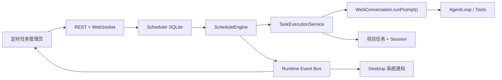

# Personal Agent 定时任务整体方案

## 方案摘要

面向 Desktop 与独立 Web Runtime 新增“自动任务”能力。调度器随 Web Server 常驻运行；Desktop 关闭窗口后继续在托盘执行，并支持登录后隐藏启动。每次触发创建独立项目任务和 Session，复用现有 Agent、工具、统计、文件 Diff 与通知能力。



实施顺序：

1. 先收敛进程级任务执行与可靠终态。
2. 建设调度存储、时间计算和执行引擎。
3. 接入 REST、WebSocket 和管理页面。
4. 完成 Desktop 自启、后台通知与打包验证。

## 产品行为

- 左侧增加固定“定时任务”入口，提供跨项目列表、创建/编辑抽屉和“配置 / 运行记录”详情。
- 支持单次、每天、每周、固定间隔，以及高级 5 字段 Cron；统一使用 IANA 时区并展示未来 5 次时间。
- Cron 和固定间隔最短 5 分钟；每次运行默认超时 60 分钟，可配置 5–240 分钟。
- 每次触发创建标题为“自动 · 计划名称 · 执行时间”的独立任务；项目侧栏放入默认折叠的“自动任务”分组。
- 运行状态统一为 `queued / running / succeeded / failed / needs_attention / cancelled / interrupted / skipped`。
- 离线期间错过多次周期触发时，仅按最近一次计划时间补跑一次并记录 `missedCount`；同一计划已有排队或运行实例时，后续 occurrence 记为 `skipped`。
- 手动“立即运行”和“重试”也创建新运行与新任务，但不推进原计划的下次执行时间。
- 暂停只影响未来触发，恢复后从当前时间重新计算，不补偿人为暂停期间的时间；单次计划入队后自动停用。
- 固定模型失效、项目不存在或归档时本次运行失败，不静默切换模型。
- 项目归档自动暂停相关计划，恢复项目后不自动启用；删除项目或计划采用软删除计划定义，保留运行历史，旧任务/会话只通过用户确认的批量清理删除。
- 首版只支持文本 Prompt，不支持长期保存图片，也不启用 Plan 模式。

## 核心实现与接口

### 1. 统一执行基础

- 新增进程级 `TaskExecutionService`、`ConversationRegistry` 和 `RuntimeEventBus`。同一 `taskId` 在进程内只允许一个 Conversation，WebSocket 仅订阅事件，不再拥有 Conversation 生命周期。
- 浏览器断开时运行继续；无订阅者且运行结束后再 checkpoint、关闭并释放 Conversation。
- Web 手工消息和 Scheduler 统一调用：

```ts
executeTask({
  taskId,
  prompt,
  source: 'interactive' | 'schedule',
  runId?,
  interactionPolicy,
  timeoutMs,
}): Promise<TaskRunResult>
```

- `WebConversation.runPrompt()` 改为返回唯一、可靠的终态；Agent 错误、用户取消、超时、checkpoint 失败和无人值守交互分别映射到明确结果。
- `TaskExecutionContext` 贯穿 `runId/taskId/projectId/sessionId/scheduleId/source`，权限检查补传任务和项目上下文，修复现有任务级规则未实际参与匹配的问题。
- Scheduler 全局并发默认 1，可配置 1–3；数据库租约确保多进程合计不超过上限，同时同一项目的自动运行保持串行。

### 2. 调度模型与持久化

新增 `packages/scheduler`，依赖锁定 `cron-parser@^5.8.1`，以其时区和 DST 计算结果为服务端唯一标准。[cron-parser 官方包](https://www.npmjs.com/package/cron-parser)

```ts
type ScheduleTrigger =
  | { kind: 'once'; at: string }
  | { kind: 'daily'; time: string }
  | { kind: 'weekly'; weekdays: number[]; time: string }
  | { kind: 'interval'; everyMinutes: number; anchorAt: string }
  | { kind: 'cron'; expression: string };

type ExecutionMode = 'safe' | 'full_auto';

interface ScheduleDefinition {
  id: string;
  name: string;
  projectId: string;
  prompt: string;
  enabled: boolean;
  trigger: ScheduleTrigger;
  timezone: string;
  model: { mode: 'inherit' } | { mode: 'fixed'; provider: string; model: string };
  executionMode: ExecutionMode;
  timeoutMinutes: number;
  notifyOnSuccess: boolean;
  notifyOnFailure: boolean;
  nextRunAt?: string;
}
```

- 使用独立数据库 `~/.personal-agent/scheduler/scheduler.db`，建立 `schedules` 与 `schedule_runs` 两表。
- 启用 WAL、`busy_timeout`、外键和 `PRAGMA user_version` 迁移；以 `UNIQUE(schedule_id, occurrence_key)` 防止重复触发。
- Run 保存 Prompt、模型、执行模式等配置快照；计划编辑只影响未来运行。
- Run 使用确定性 `taskId`，解决 SQLite 已创建运行但 `projects.json` 尚未关联时的崩溃恢复问题。
- 调度扫描采用“最近到期时间、最长 30 秒”的单次计时器；创建、编辑、恢复以及系统时间跳变后立即重算。
- Claim、occurrence 创建和 `next_run_at` 推进必须在同一 SQLite 事务中完成；运行租约每 30 秒续期、120 秒过期。
- 重启后继续未开始的 `queued` Run；过期的 `running` Run 标记 `interrupted`，不自动重放可能已经产生副作用的 Agent 操作。

### 3. 无人值守安全

- 默认 `safe`：只允许无需审批的工具和配置中明确 `allow` 的规则；需要审批或调用 `ask_user` 时立即终止并标记 `needs_attention`。
- `full_auto` 必须逐条计划显式开启并确认风险；自动批准文件写入、Shell、网络及 MCP 工具，但仍受现有沙箱、路径约束和工具超时限制。
- 无人值守系统提示明确禁止等待用户回答；`ask_user` 即使由模型调用，也不会悬挂五分钟。
- 超时由执行服务中断 Agent、执行最终 checkpoint，并以 `failed + RUN_TIMEOUT` 落盘；用户主动取消为 `cancelled`，进程退出或租约失效为 `interrupted`。

### 4. API、协议与界面

REST：

```text
GET    /api/schedules
POST   /api/schedules
GET    /api/schedules/:id
PUT    /api/schedules/:id
DELETE /api/schedules/:id
POST   /api/schedules/preview
POST   /api/schedules/:id/run
GET    /api/schedules/:id/runs?cursor=&limit=
POST   /api/schedule-runs/:id/cancel
POST   /api/schedule-runs/:id/retry
GET/PUT /api/scheduler-settings
```

WebSocket 增加：

```ts
{ type: 'schedule_changed'; schedule: ScheduleSummary }
{ type: 'schedule_deleted'; scheduleId: string }
{ type: 'schedule_run_changed'; run: ScheduleRunSummary }
```

- `TaskSummary/ProjectTask` 增加可选的 `origin: 'manual' | 'schedule'`、`scheduleId`、`scheduleRunId`。
- 管理页支持项目、启停和结果筛选；运行记录可打开关联任务、取消、重试或批量清理。
- 全局设置包含默认时区、后台并发 1–3、通知默认值；失败、需处理和中断默认通知，成功默认不通知。
- Desktop 新增登录自启 IPC。打包环境调用 Electron 登录项 API并携带 `--hidden`，自启后只显示托盘。
- 调度通知直接由 Electron 主进程订阅 Runtime Event Bus，不依赖隐藏页面；点击后跳转到任务或对应计划运行。

## 测试与验收

- 时间计算：五种触发类型、非法 Cron/时区、未来 5 次预览、DST 前进/回拨、5 分钟频率下限。
- Store：幂等初始化、迁移、CRUD、软删除、唯一 occurrence、两个数据库实例并发 claim、租约与全局并发。
- Engine：准点触发、睡眠恢复、多个错过合并一次、暂停恢复、同计划重叠跳过、单次自动停用。
- 恢复：`queued` 重启续跑，过期 `running` 只标记 `interrupted`，手动重试生成新 Run。
- 执行：两个 WebSocket 与 Scheduler 不重复创建同一 Conversation；页面断开不终止后台任务；所有路径只产生一个终态。
- 安全：safe 模式审批和提问进入 `needs_attention`；full-auto 工具自动通过但沙箱仍生效；固定模型失效不回退。
- API/协议：鉴权、输入校验、分页、取消/重试、WebSocket 全局广播。
- UI/Desktop：自动任务折叠分组、运行详情跳转、托盘隐藏时触发、登录自启、成功/失败通知点击跳转。
- 完成全仓 typecheck、测试、构建，并补 Electron 打包环境下 `node:sqlite` 与托盘常驻冒烟测试。

## 假设与首版边界

- 仅承诺 Desktop 或 Web Server 进程运行期间准时触发；不集成 Windows 系统唤醒或系统服务。
- Desktop 登录自启用于提升常驻性；电脑休眠或应用退出期间通过“补跑一次”恢复。
- CLI 不提供 daemon，只可在后续增加查询和管理命令。
- 不自动删除任何运行记录、任务或 Session；批量清理必须二次确认。
- SQLite 防重能避免同一 occurrence 被重复 claim，但 Agent 外部副作用无法做到严格 exactly-once，因此崩溃中的 Run 不自动重试。
